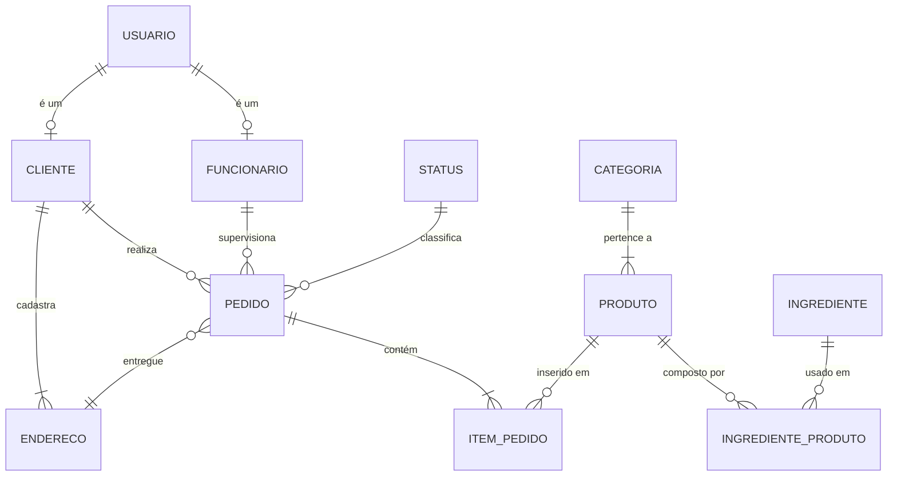

# DER — Pizzaria do Barriga

## 1. Diagrama

## 2. Dicionário de dados

### Tabela: usuario
| Campo | Tipo | Restrições | Descrição |
|---|---|---|---|
| id_usuario | SERIAL | PK | |
| email | VARCHAR | NOT NULL | |
| senha | VARCHAR | NOT NULL | |
| ativo | BOOLEAN | NOT NULL | |
| nome_perfil | VARCHAR | | |
| descricao | VARCHAR | | |

### Tabela: funcionario
| Campo | Tipo | Restrições | Descrição |
|---|---|---|---|
| id_funcionario | SERIAL | PK | |
| id_usuario | INT | FK -> usuario.id_usuario | |
| nome | VARCHAR | NOT NULL | |
| cpf | VARCHAR | NOT NULL, UNIQUE | |
| cargo | VARCHAR | | |
| telefone | VARCHAR | | |

### Tabela: cliente
| Campo | Tipo | Restrições | Descrição |
|---|---|---|---|
| id_cliente | SERIAL | PK | |
| id_usuario | INT | FK -> usuario.id_usuario | |
| nome | VARCHAR | NOT NULL | |
| cpf | VARCHAR | NOT NULL, UNIQUE | |
| telefone | VARCHAR | | |

### Tabela: endereco
| Campo | Tipo | Restrições | Descrição |
|---|---|---|---|
| id_endereco | SERIAL | PK | |
| id_cliente | INT | FK -> cliente.id_cliente | |
| cep | VARCHAR | NOT NULL | |
| logradouro | VARCHAR | NOT NULL | |
| numero | VARCHAR | | |
| complemento | VARCHAR | | |
| bairro | VARCHAR | | |
| cidade | VARCHAR | | |
| uf | VARCHAR | | |

### Tabela: categoria
| Campo | Tipo | Restrições | Descrição |
|---|---|---|---|
| id_categoria | SERIAL | PK | |
| nome | VARCHAR | NOT NULL | |
| descricao | VARCHAR | | |

### Tabela: produto
| Campo | Tipo | Restrições | Descrição |
|---|---|---|---|
| id_produto | SERIAL | PK | |
| id_categoria | INT | FK -> categoria.id_categoria | |
| nome | VARCHAR | NOT NULL | |
| tamanho | VARCHAR | | |
| preco | DOUBLE | NOT NULL | |
| disponivel | BOOLEAN | NOT NULL | |

### Tabela: ingrediente
| Campo | Tipo | Restrições | Descrição |
|---|---|---|---|
| id_ingrediente | SERIAL | PK | |
| nome | VARCHAR | NOT NULL | |
| quantidade_estoque | DOUBLE | | |
| unidade_medida | VARCHAR | | |

### Tabela: ingrediente_produto (associativa N:N)
| Campo | Tipo | Restrições | Descrição |
|---|---|---|---|
| id_ingrediente_produto | SERIAL | PK | |
| id_produto | INT | FK -> produto.id_produto | |
| id_ingrediente | INT | FK -> ingrediente.id_ingrediente | |
| quantidade_necessaria | DOUBLE | | |

### Tabela: status
| Campo | Tipo | Restrições | Descrição |
|---|---|---|---|
| id_status | SERIAL | PK | |
| nome_status | VARCHAR | NOT NULL | |

### Tabela: pedido
| Campo | Tipo | Restrições | Descrição |
|---|---|---|---|
| id_pedido | SERIAL | PK | |
| id_cliente | INT | FK -> cliente.id_cliente | |
| id_funcionario | INT | FK -> funcionario.id_funcionario | |
| id_status | INT | FK -> status.id_status | |
| id_endereco | INT | FK -> endereco.id_endereco | |
| data_hora_pedido | TIMESTAMP | NOT NULL | |
| forma_pagamento | VARCHAR | | |
| taxa_entrega | DOUBLE | | |
| valor_total | DOUBLE | | |

### Tabela: item_pedido
| Campo | Tipo | Restrições | Descrição |
|---|---|---|---|
| id_item_pedido | SERIAL | PK | |
| id_pedido | INT | FK -> pedido.id_pedido | |
| id_produto | INT | FK -> produto.id_produto | |
| quantidade | INT | NOT NULL | |
| preco_unitario | DOUBLE | NOT NULL | |
| subtotal | DOUBLE | NOT NULL | |
| observacao | VARCHAR | | |