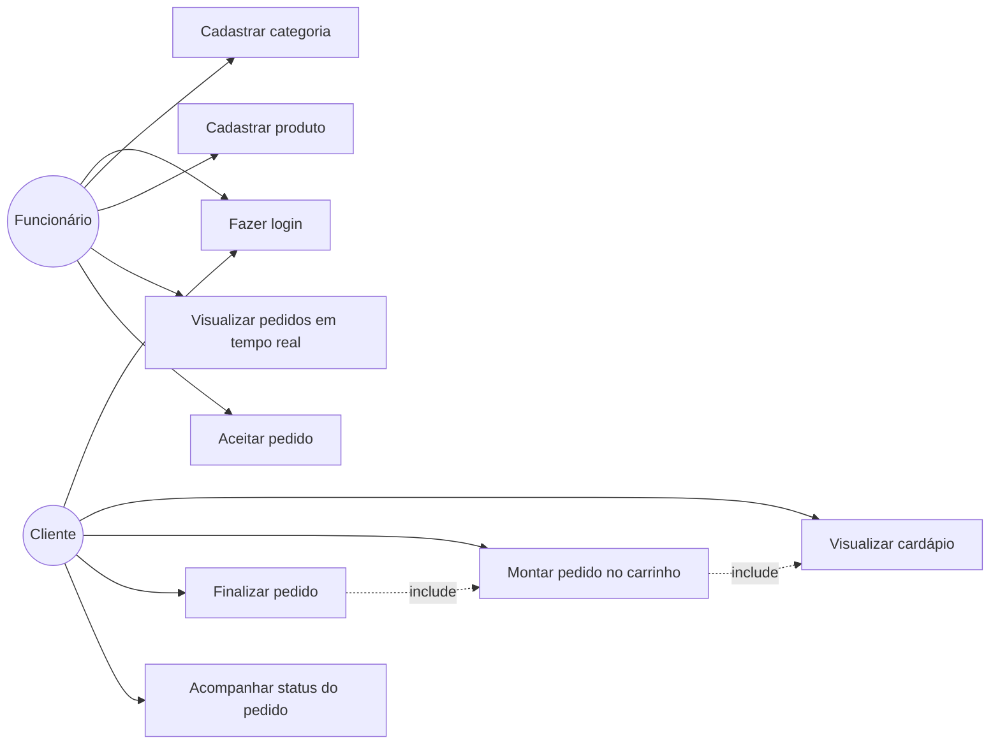
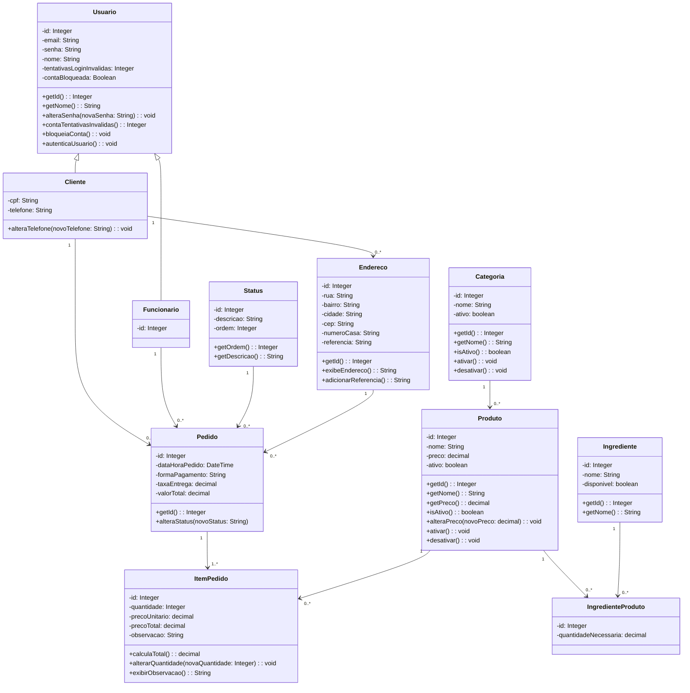

# Diagramas UML — Pizzaria do Barriga

**Equipe:** Gabriel Freire Flôres (RA 2840482423010) — Marcelo Augusto Oliveira Jose (RA 2840482423043) — Christian de Lima (RA 2840482523031) — Guilherme Fabiano da Silva Gomes (RA 2840482423037)
**Trilha:** B (Cliente real nº 1)

## 1. Diagrama de Casos de Uso

## 2. Diagrama de Classes

## 3. Rastreabilidade

| Caso de uso | História(s) relacionada(s) (E2) |
|---|---|
| Visualizar cardápio | #4 |
| Montar pedido no carrinho | #5 |
| Finalizar pedido | #6 |
