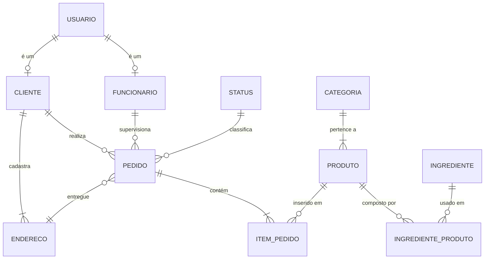

# DER — Pizzaria do Barriga

**Equipe:** Gabriel Freire Flôres (RA 2840482423010) — Marcelo Augusto Oliveira Jose (RA 2840482423043) — Christian de Lima (RA 2840482523031) — Guilherme Fabiano da Silva Gomes (RA 2840482423037)
**Trilha:** B (Cliente real nº 1)

## 1. Diagrama

## 2. Dicionário de dados

## 1. Tabela: usuario
Representa as credenciais e dados comuns de acesso ao sistema para diferentes perfis.

| Campo | Tipo | Restrições | Descrição |
|---|---|---|---|
| id_usuario | SERIAL | PK | Identificador único do usuário |
| email | VARCHAR(160) | NOT NULL, UNIQUE | E-mail de acesso do usuário (único) |
| senha | VARCHAR(255) | NOT NULL | Senha criptografada do usuário |
| ativo | BOOLEAN | NOT NULL | Indica se o usuário está ativo no sistema |
| nome_perfil | VARCHAR(80) | NOT NULL | Perfil de acesso (cliente, funcionario, etc) |
| descricao | VARCHAR(500) | | Observações adicionais sobre o usuário |

---

## 2. Tabela: funcionario
Especialização da entidade usuário para os funcionários da pizzaria.

| Campo | Tipo | Restrições | Descrição |
|---|---|---|---|
| id_funcionario | SERIAL | PK | Identificador único do funcionário |
| id_usuario | INT | FK, NOT NULL | Referência ao usuário do sistema |
| nome | VARCHAR(120) | NOT NULL | Nome completo do funcionário |
| cpf | VARCHAR(14) | NOT NULL, UNIQUE | CPF do funcionário (único) |
| cargo | VARCHAR(80) | NOT NULL | Cargo exercido na pizzaria |
| telefone | VARCHAR(20) | | Telefone de contato do funcionário |

---

## 3. Tabela: cliente
Especialização da entidade usuário para os clientes cadastrados.

| Campo | Tipo | Restrições | Descrição |
|---|---|---|---|
| id_cliente | SERIAL | PK | Identificador único do cliente |
| id_usuario | INT | FK, NOT NULL | Referência ao usuário do sistema |
| nome | VARCHAR(120) | NOT NULL | Nome completo do cliente |
| cpf | VARCHAR(14) | NOT NULL, UNIQUE | CPF do cliente (único) |
| telefone | VARCHAR(20) | | Telefone de contato do cliente |

---

## 4. Tabela: endereco
Armazena os endereços de entrega vinculados aos clientes.

| Campo | Tipo | Restrições | Descrição |
|---|---|---|---|
| id_endereco | SERIAL | PK | Identificador único do endereço |
| id_cliente | INT | FK, NOT NULL | Cliente proprietário do endereço |
| cep | VARCHAR(9) | NOT NULL | CEP do endereço de entrega |
| logradouro | VARCHAR(160) | NOT NULL | Rua, avenida ou logradouro |
| numero | VARCHAR(20) | NOT NULL | Número do imóvel |
| complemento | VARCHAR(100) | | Complemento (bloco, apartamento, etc) |
| bairro | VARCHAR(100) | NOT NULL | Bairro do endereço |
| cidade | VARCHAR(100) | NOT NULL | Cidade do endereço |
| uf | CHAR(2) | NOT NULL | Estado (UF) com 2 letras |

---

## 5. Tabela: categoria
Categorização dos produtos oferecidos no cardápio.

| Campo | Tipo | Restrições | Descrição |
|---|---|---|---|
| id_categoria | SERIAL | PK | Identificador único da categoria |
| nome | VARCHAR(100) | NOT NULL, UNIQUE | Nome da categoria de produtos (ex: Pizzas, Bebidas) |
| descricao | VARCHAR(500) | | Descrição detalhada da categoria |

---

## 6. Tabela: produto
Itens comercializados pela pizzaria.

| Campo | Tipo | Restrições | Descrição |
|---|---|---|---|
| id_produto | SERIAL | PK | Identificador único do produto |
| id_categoria | INT | FK, NOT NULL | Categoria a qual o produto pertence |
| nome | VARCHAR(120) | NOT NULL | Nome comercial do produto |
| tamanho | VARCHAR(30) | NOT NULL | Tamanho do produto (ex: Grande, 2 litros) |
| preco | NUMERIC(10,2) | NOT NULL | Preço de venda do produto |
| disponivel | BOOLEAN | NOT NULL | Indica se o produto está disponível no cardápio |

---

## 7. Tabela: ingrediente
Ingredientes utilizados para compor os produtos.

| Campo | Tipo | Restrições | Descrição |
|---|---|---|---|
| id_ingrediente | SERIAL | PK | Identificador único do ingrediente |
| nome | VARCHAR(120) | NOT NULL, UNIQUE | Nome do ingrediente |
| quantidade_estoque | NUMERIC(12,3) | NOT NULL | Quantidade atual disponível em estoque |
| unidade_medida | VARCHAR(20) | NOT NULL | Unidade de medida (kg, litro, unidade) |

---

## 8. Tabela: ingrediente_produto (Associativa N:N)
Relaciona os produtos aos ingredientes necessários para sua fabricação (ficha técnica).

| Campo | Tipo | Restrições | Descrição |
|---|---|---|---|
| id_ingrediente_produto | SERIAL | PK | Identificador da relação |
| id_produto | INT | FK, NOT NULL | Produto associado |
| id_ingrediente | INT | FK, NOT NULL | Ingrediente utilizado |
| quantidade_necessaria | NUMERIC(12,3) | NOT NULL | Quantidade do ingrediente gasta no produto |

---

## 9. Tabela: status
Domínio dos estados possíveis de um pedido.

| Campo | Tipo | Restrições | Descrição |
|---|---|---|---|
| id_status | SERIAL | PK | Identificador único do status |
| nome_status | VARCHAR(50) | NOT NULL, UNIQUE | Descrição do estado do pedido (ex: Recebido, Entregue) |

---

## 10. Tabela: pedido
Registro principal das vendas realizadas.

| Campo | Tipo | Restrições | Descrição |
|---|---|---|---|
| id_pedido | SERIAL | PK | Identificador único do pedido |
| id_cliente | INT | FK, NOT NULL | Cliente que realizou o pedido |
| id_funcionario | INT | FK, NOT NULL | Funcionário que supervisiona o pedido |
| id_status | INT | FK, NOT NULL | Status atual do pedido |
| id_endereco | INT | FK, NOT NULL | Endereço de entrega do pedido |
| data_hora_pedido | TIMESTAMP | NOT NULL | Data e hora em que o pedido foi efetuado |
| forma_pagamento | VARCHAR(40) | NOT NULL | Forma de pagamento escolhida (PIX, Cartão, etc) |
| taxa_entrega | NUMERIC(10,2) | NOT NULL | Valor da taxa de entrega cobrada |
| valor_total | NUMERIC(12,2) | NOT NULL | Valor total final do pedido com taxas |

---

## 11. Tabela: item_pedido
Itens detalhados contidos em cada pedido.

| Campo | Tipo | Restrições | Descrição |
|---|---|---|---|
| id_item_pedido | SERIAL | PK | Identificador único do item do pedido |
| id_pedido | INT | FK, NOT NULL | Pedido ao qual o item pertence |
| id_produto | INT | FK, NOT NULL | Produto incluído no pedido |
| quantidade | INT | NOT NULL | Quantidade de unidades do produto solicitadas |
| preco_unitario | NUMERIC(10,2) | NOT NULL | Preço unitário do produto no momento da compra |
| subtotal | NUMERIC(12,2) | NOT NULL | Subtotal calculado (quantidade * preco_unitario) |
| observacao | VARCHAR(500) | | Observações específicas do item (ex: sem cebola) |
